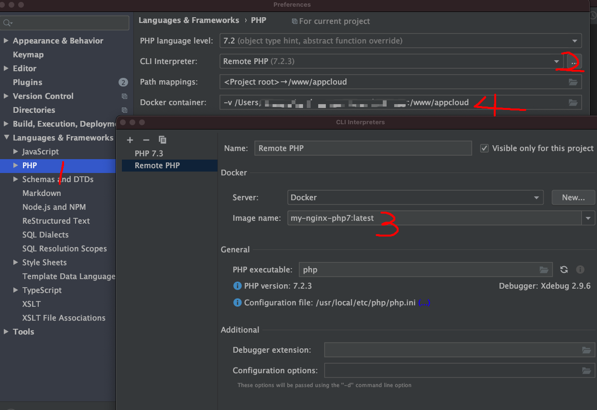
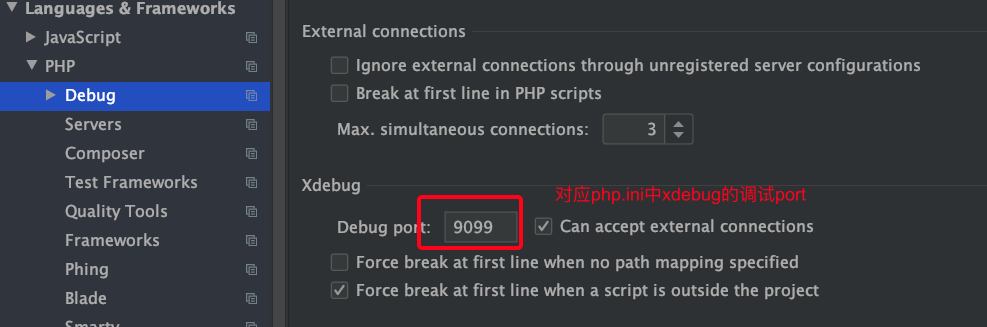
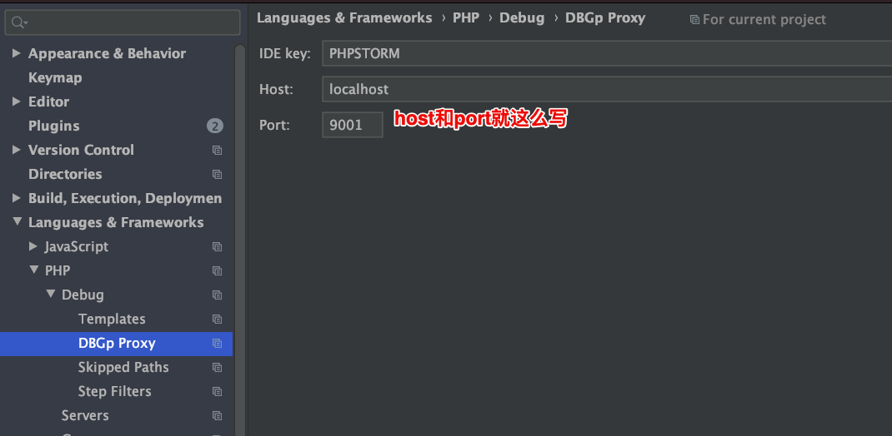
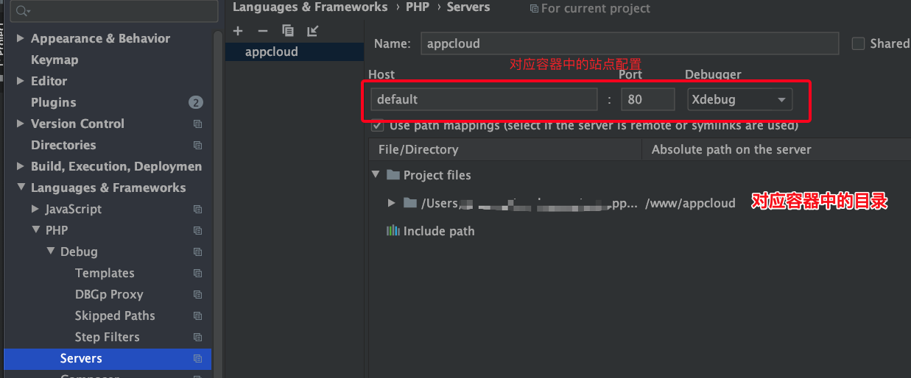
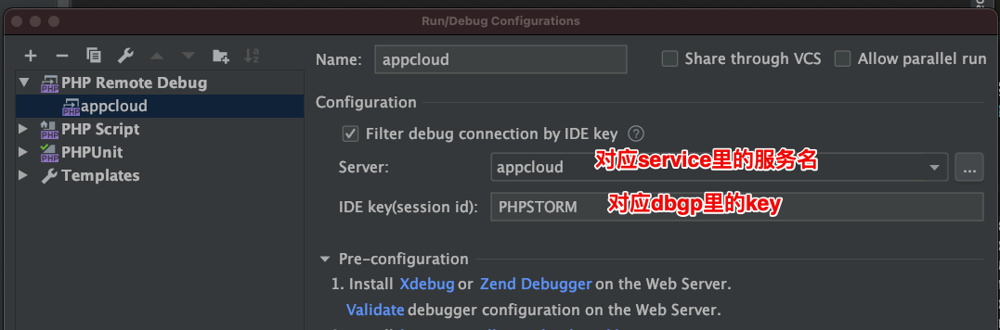

## 镜像中安装xdebug
### 确定要安装的xdebug版本
1、输出phpinfo
```
$ php -i
```

2、将输出复制到下述页面，确认xdebug版本
> https://xdebug.org/wizard

3、安装xdebug扩展

### php.ini中xdebug配置
```
zend_extension=xdebug.so
xdebug.remote_port=9099
xdebug.remote_autostart=1
xdebug.remote_enable=1
xdebug.remote_host=host.docker.internal
xdebug.remote_handler=dbgp
xdebug.idekey=PHPSTORM
xdebug.remote_log=/var/log/xdebug.log
```
** xdebug.remote_connect_back 要为0，具体见 https://www.fanhaobai.com/2017/09/xdebug-in-docker.html **

## phpstorm配置
[配置参考](https://www.jianshu.com/p/bfeaa9fbd20b)





